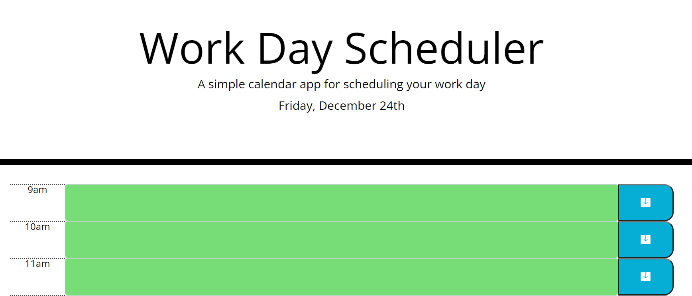

# Work Day Scheduler
## Purpose
A website that uses third-party-APIs such as JQUERY, Moment.js, and Bootstrap to allow the user to add events to a day-planner.
## Built With
- HTML
- CSS
- Bootstrap
- JavaScript
- JQUERY
- Moment.js
## Website
https://mimi5930.github.io/work-day-scheduler/

